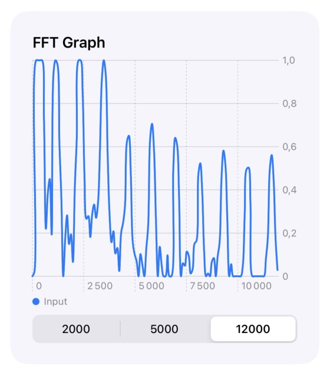

# FFT Graph View

Ce repo permet de disposer d'un graphe qui présente la transformée de Fourier (FFT) du signal en entrée du microphone

# Installation

- Le fichier FFT doit être copié tel quel
- Dans le fichier AudioPipeline: la struc LineChartData, les fonctions makeSpectrumFromAudio, updateGraph et startEngine doivent être conservées. Les variables spectrumWidth, spectrumArray et data doivent être bien définies. Enfin, le Tap doit être configuré sur un noeud de Mix (lignes 55 à 67 du fichier ici)
- Dans le fichier ContentView, la struct AudioFrequencyGraph peut être copiée telle quelle pour le front
