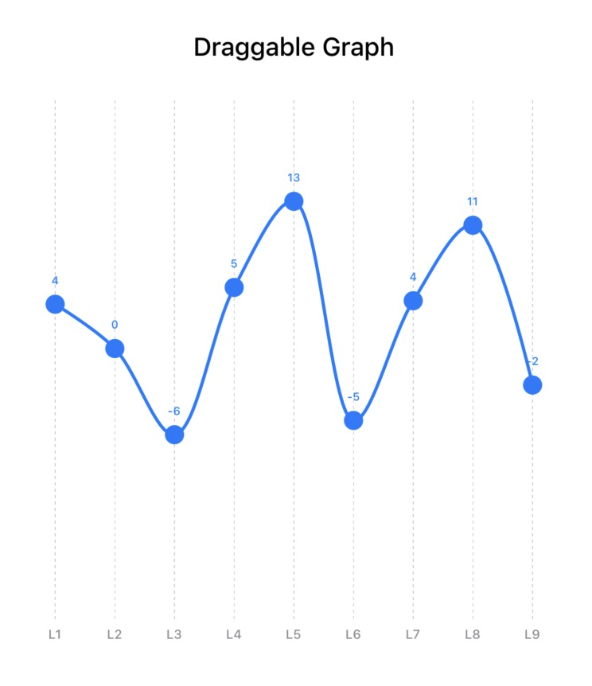
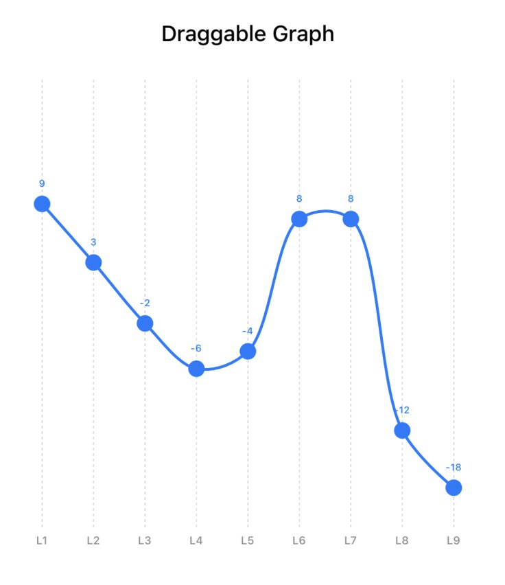
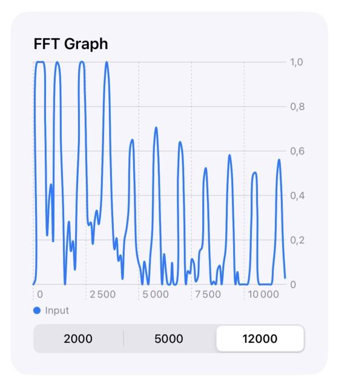
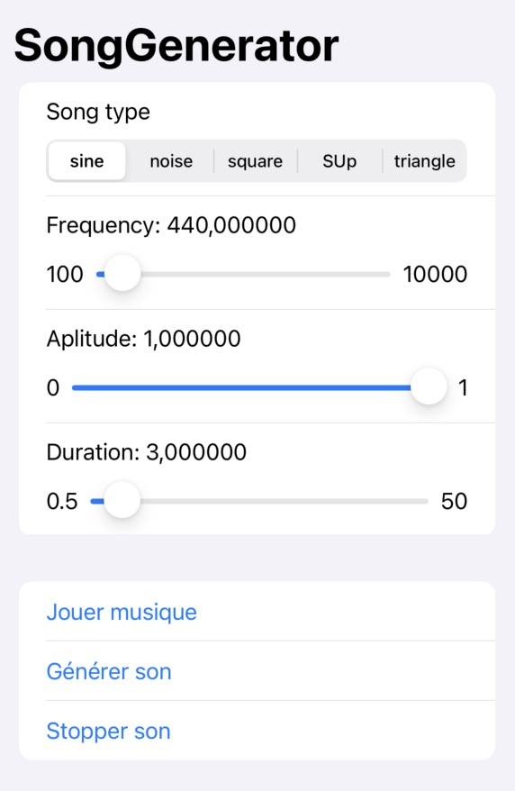

# Swift-utils

Swift utils & tools for audio and grah visualisation

## Draggable Graph

This tool allows you to create a graph whose values can be modified by dragging and dropping.

  
   

## FFT Graph

This tool allows you to create a FFT graph from an audio signal in real time, from the mic input of yout hardware.
A FFT Graph present the severals frequencies of an audio signal and their respective amplitudes

## Sound Generator

This tool allow you to generate several signals: sinusoids, crenels, triangles, etc.

